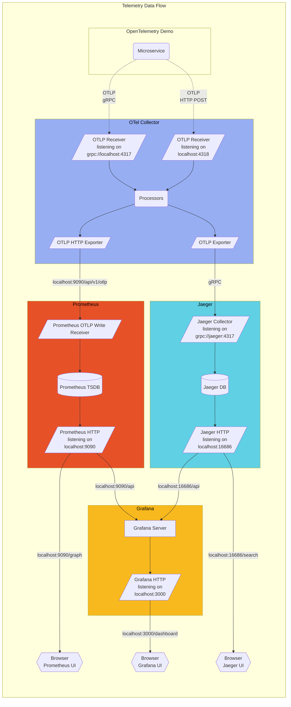

# NDTCore.OpenTelemetry

# 🚀 Hướng dẫn chạy project với Docker Compose

## 1️⃣ Chạy service setup

Chạy lệnh sau để khởi động service `setup`:

```sh
docker compose up setup -d
```

## 2️⃣ Chạy toàn bộ project

Sau khi `setup` đã khởi động thành công, chạy lệnh sau để khởi động toàn bộ services:

```sh
docker compose up -d
```

🎯 **Lưu ý:**

- Đảm bảo đã cài đặt **Docker** và **Docker Compose** trước khi chạy lệnh.
- Dùng `docker ps` để kiểm tra các container đang chạy.
- Nếu gặp lỗi, kiểm tra logs bằng `docker compose logs -f`.

## 3️⃣ Data Flow
